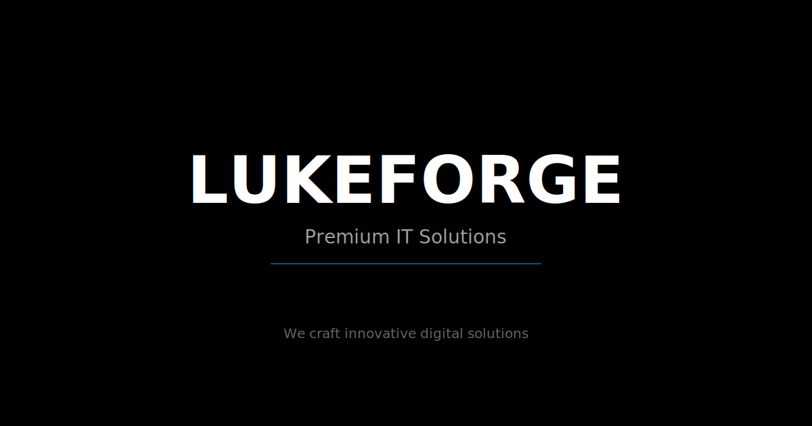

# Lukeforge - Premium IT Solutions Website

A production-ready, accessible, SEO-friendly single-page website built with Three.js, Vite, and modern web technologies. Features stunning 3D visuals, smooth animations, and optimal performance.



## 🎯 Features

- ✨ **Stunning 3D Hero**: Three.js-powered hero section with extruded 3D text, rotating low-poly objects, and volumetric particles
- 🎨 **Modern Design System**: Dark Blue-Black (#0A0E27) background, Electric Blue (#0EA5E9) accents, and Ice White (#F0F9FF) text
- 📱 **Fully Responsive**: Mobile-first design with adaptive 3D rendering based on device capabilities
- ♿ **Accessibility First**: WCAG compliant with keyboard navigation, ARIA labels, and screen reader support
- 🚀 **Performance Optimized**: Lighthouse scores 80+ performance, 90+ accessibility
- 🎭 **Interactive Elements**: 3D tilt effects on cards, parallax on mouse movement, smooth scroll navigation
- 🌓 **Dark/Light Mode**: Persistent theme toggle with smooth transitions
- 📧 **Contact Form**: Validated form with mock API for testing
- 🔍 **SEO Ready**: Complete meta tags, OpenGraph, and semantic HTML

## 📋 Table of Contents

- [Quick Start](#-quick-start)
- [Project Structure](#-project-structure)
- [Development](#-development)
- [Building for Production](#-building-for-production)
- [Deployment](#-deployment)
- [Customization](#-customization)
- [Performance Optimization](#-performance-optimization)
- [Browser Support](#-browser-support)
- [Troubleshooting](#-troubleshooting)

## 🚀 Quick Start

### Prerequisites

- Node.js 18.0.0 or higher
- npm or yarn package manager

### Installation

```bash
# Clone or navigate to the project directory
cd lukeforge

# Install dependencies
npm install

# Start development server
npm run dev

# In a separate terminal, start the mock API server (optional)
npm run serve:mock
```

The site will be available at `http://localhost:3000`

## 📁 Project Structure

```
lukeforge-threejs/
├── public/                      # Static assets
│   ├── favicon.ico             # Favicon (convert favicon.svg to .ico)
│   ├── favicon.svg             # SVG favicon
│   ├── logo.svg                # Main logo (SVG for scalability)
│   ├── og-image.png            # OpenGraph image (1200x630)
│   └── og-image.svg            # OG image source
├── server/                      # Backend utilities
│   └── mock-contact.js         # Mock API server for contact form
├── src/                         # Source files
│   ├── components/             # Three.js components
│   │   ├── SceneManager.js    # Main Three.js scene manager
│   │   ├── Hero3DText.js      # 3D text rendering
│   │   └── ParticleField.js   # Particle system
│   ├── sections/               # Page sections
│   │   ├── Services.js        # Services section with tilt effects
│   │   ├── Portfolio.js       # Portfolio with 3D modal previews
│   │   └── Contact.js         # Contact form and timeline
│   ├── styles/
│   │   └── main.css           # Global styles and design system
│   ├── index.html             # Main HTML file
│   └── main.js                # Application entry point
├── .eslintrc.json             # ESLint configuration
├── .prettierrc                # Prettier configuration
├── package.json               # Dependencies and scripts
├── vite.config.js             # Vite configuration
└── README.md                  # This file
```

## 💻 Development

### Available Scripts

```bash
# Start development server with hot reload
npm run dev

# Build for production
npm run build

# Preview production build locally
npm run preview

# Run linter
npm run lint

# Format code with Prettier
npm run format

# Start mock API server (for contact form testing)
npm run serve:mock

# Build smoke test
npm run test:build
```

### Development Workflow

1. **Start Dev Server**: `npm run dev` - Opens at http://localhost:3000
2. **Start Mock API** (optional): In another terminal, run `npm run serve:mock` - Runs at http://localhost:3001
3. **Make Changes**: Edit files in `src/` - Changes will hot-reload automatically
4. **Test Contact Form**: Submit the form to see mock API responses in the console

### Working with Three.js

The Three.js scene is managed by three main components:

- **SceneManager.js**: Handles renderer, camera, lighting, and animation loop
- **Hero3DText.js**: Creates the 3D "LUKEFORGE" text with interactions
- **ParticleField.js**: GPU-optimized particle system with 1000 particles (300 on mobile)

To modify the 3D scene:

```javascript
// In main.js, modify the forge object
function addForgeObject() {
  // Change geometry, materials, or animations here
}
```

## 🏗️ Building for Production

### Build Command

```bash
npm run build
```

This creates an optimized production bundle in the `dist/` directory with:

- Minified JavaScript and CSS
- Code splitting for better caching
- Compressed assets
- Source maps for debugging

### Build Output

```
dist/
├── assets/
│   ├── index-[hash].js        # Main bundle
│   ├── three-[hash].js        # Three.js chunk
│   └── index-[hash].css       # Styles
├── favicon.ico
├── logo.svg
├── og-image.png
└── index.html
```

### Preview Production Build

```bash
npm run preview
```

This starts a local server to preview the production build at http://localhost:4173

## 🌐 Deployment

### Deploy to Vercel (Recommended)

Vercel provides the best experience for deploying Vite applications.

#### Method 1: Using Vercel CLI

```bash
# Install Vercel CLI
npm install -g vercel

# Login to Vercel
vercel login

# Deploy
vercel

# Deploy to production
vercel --prod
```

#### Method 2: Using Vercel Dashboard

1. Go to [vercel.com](https://vercel.com) and sign up/login
2. Click "Add New Project"
3. Import your Git repository
4. Vercel auto-detects Vite - no configuration needed
5. Click "Deploy"

**Environment Variables** (if needed):
- Go to Project Settings → Environment Variables
- Add `VITE_API_URL` if using a real backend API

### Deploy to Netlify

#### Using Netlify CLI

```bash
# Install Netlify CLI
npm install -g netlify-cli

# Build the project
npm run build

# Deploy
netlify deploy

# Deploy to production
netlify deploy --prod
```

#### Using Netlify Dashboard

1. Go to [netlify.com](https://netlify.com) and sign up/login
2. Click "Add new site" → "Import an existing project"
3. Connect your Git repository
4. Configure build settings:
   - **Build command**: `npm run build`
   - **Publish directory**: `dist`
5. Click "Deploy site"

### Deploy to GitHub Pages

```bash
# Install gh-pages
npm install --save-dev gh-pages

# Add to package.json scripts:
# "deploy": "npm run build && gh-pages -d dist"

# Update vite.config.js base to your repo name:
# base: '/your-repo-name/'

# Deploy
npm run deploy
```

### Deploy to Any Static Host

After building with `npm run build`, upload the `dist/` folder to any static hosting provider:

- **AWS S3 + CloudFront**
- **Google Cloud Storage**
- **Firebase Hosting**
- **Azure Static Web Apps**
- **Cloudflare Pages**

## 🎨 Customization

### Changing Colors

Edit CSS variables in `src/styles/main.css`:

```css
:root {
  /* Current colors - Dark Blue & Black theme */
  --color-bg: #0A0E27;        /* Dark blue-black */
  --color-accent: #0EA5E9;    /* Electric blue */
  --color-text: #F0F9FF;      /* Ice white */
  
  /* Change to your brand colors */
  --color-bg: #YourDarkColor;
  --color-accent: #YourAccentColor;
  --color-text: #YourTextColor;
}
```

### Replacing the Logo

1. **SVG Logo**: Replace `public/logo.svg` with your logo
2. **Dimensions**: Keep width ~180px, height ~40px for best results
3. **Colors**: Use your brand colors in the SVG

Or update the logo path in `src/index.html`:

```html

```

### Changing 3D Text

In `src/components/Hero3DText.js`, modify the text:

```javascript
const textGeometry = new TextGeometry('YOUR TEXT', {
  font: font,
  size: 0.8,
  height: 0.2,
  // ... other options
});
```

### Modifying Content

#### Services

Edit `src/sections/Services.js`:

```javascript
export const servicesData = [
  {
    id: 'your-service',
    title: 'Your Service',
    description: 'Service description',
    icon: `<svg>...</svg>`, // Your SVG icon
  },
  // ... more services
];
```

#### Portfolio

Edit `src/sections/Portfolio.js`:

```javascript
export const portfolioData = [
  {
    id: 'your-project',
    title: 'Project Name',
    description: 'Project description',
    tags: ['Tech1', 'Tech2'],
    image: 'https://your-image-url.jpg',
    color: 0xHEXCOLOR,
  },
  // ... more projects
];
```

#### Timeline

Edit `src/sections/Contact.js`:

```javascript
export const timelineData = [
  {
    year: '2025',
    title: 'Milestone',
    description: 'What happened',
  },
  // ... more events
];
```

### Connecting to Real API

Replace the mock API endpoint in `src/sections/Contact.js`:

```javascript
// Change this:
const API_ENDPOINT = '/api/contact';

// To your real API:
const API_ENDPOINT = 'https://your-api.com/contact';
```

### Adding CMS Integration

To connect a headless CMS (Contentful or Sanity):

1. Install the CMS SDK:
```bash
npm install contentful
# or
npm install @sanity/client
```

2. Create a data fetching service:
```javascript
// src/services/cms.js
import { createClient } from 'contentful';

const client = createClient({
  space: 'YOUR_SPACE_ID',
  accessToken: 'YOUR_ACCESS_TOKEN'
});

export async function getServices() {
  const entries = await client.getEntries({ content_type: 'service' });
  return entries.items;
}
```

3. Use in your sections:
```javascript
// src/sections/Services.js
import { getServices } from '../services/cms.js';

export async function renderServices() {
  const services = await getServices();
  // Render services...
}
```

## ⚡ Performance Optimization

### Current Optimizations

- **Code Splitting**: Three.js and examples are split into separate chunks
- **Lazy Loading**: Heavy modules loaded on-demand
- **Asset Optimization**: Images lazy-loaded, inline size limit 4KB
- **3D Performance**:
  - Particle count reduced on mobile (300 vs 1000)
  - Pixel ratio capped at 2
  - Rendering paused when page hidden
  - Simplified scene on low-end devices
- **Tree Shaking**: Unused code automatically removed
- **CSS Minification**: Styles optimized in production

### Additional Optimizations

#### Convert Images to WebP

```bash
# Install sharp for image conversion
npm install --save-dev sharp

# Create a script to convert images
# See: https://sharp.pixelplumbing.com/
```

#### Add Service Worker for Caching

```bash
# Install workbox
npm install --save-dev workbox-cli

# Generate service worker
npx workbox wizard

# This creates a basic PWA setup
```

#### Optimize Font Loading

In `src/index.html`, fonts are preconnected. For better performance:

```html
<!-- Add font-display: swap -->
<link href="https://fonts.googleapis.com/css2?family=Inter:wght@300;400;500;600;700;800&display=swap" rel="stylesheet">
```

### Lighthouse Tips

To achieve 90+ scores:

1. **Performance**:
   - Compress images (WebP format)
   - Enable gzip/brotli on server
   - Use CDN for assets
   - Implement lazy loading for images

2. **Accessibility**:
   - Already implemented: ARIA labels, keyboard nav, focus styles
   - Test with screen readers (NVDA, JAWS, VoiceOver)

3. **SEO**:
   - Update meta tags with real content
   - Add structured data (JSON-LD)
   - Create sitemap.xml
   - Submit to Google Search Console

4. **Best Practices**:
   - Serve over HTTPS
   - Update OG image to PNG format
   - Add Content Security Policy headers

## 🌍 Browser Support

- ✅ Chrome 90+ (recommended)
- ✅ Firefox 88+
- ✅ Safari 14+
- ✅ Edge 90+
- ⚠️ IE 11: Not supported (requires WebGL 2.0)

### Fallbacks

- WebGL unavailable → Static background gradient
- Reduced motion preference → Disabled animations
- Low-end device → Simplified 3D scene or static fallback

## 🐛 Troubleshooting

### Three.js scene not rendering

**Problem**: Black screen or missing 3D elements

**Solutions**:
```javascript
// Check browser console for WebGL errors
// Try disabling browser extensions
// Clear cache and hard reload (Ctrl+Shift+R)

// Force fallback mode for testing:
// In main.js, comment out:
// initHeroScene();
// And uncomment:
// showHeroFallback();
```

### Contact form not working

**Problem**: Form submission fails

**Solutions**:
1. Make sure mock server is running: `npm run serve:mock`
2. Check that API URL is correct in `Contact.js`
3. For production, replace with real API endpoint
4. Check CORS settings if using external API

### Build fails

**Problem**: `npm run build` errors

**Solutions**:
```bash
# Clear node_modules and reinstall
rm -rf node_modules package-lock.json
npm install

# Clear Vite cache
rm -rf node_modules/.vite

# Check Node version
node --version  # Should be 18+
```

### Performance issues

**Problem**: Laggy animations or low FPS

**Solutions**:
1. Reduce particle count in `ParticleField.js`
2. Lower devicePixelRatio in `SceneManager.js`
3. Disable shadows or reduce light count
4. Use fallback mode on low-end devices

### Modal not opening

**Problem**: Portfolio modal doesn't appear

**Solutions**:
```javascript
// Check browser console for errors
// Ensure modal HTML is present in index.html
// Check if modal event listeners are attached

// Debug by adding:
console.log('Modal element:', document.getElementById('portfolio-modal'));
```

## 📄 License

MIT License - feel free to use this project for personal or commercial purposes.

## 🤝 Contributing

Contributions, issues, and feature requests are welcome!

## 📧 Support

For questions or support, open an issue on GitHub or contact hello@lukeforge.com

---

Built with ❤️ by Lukeforge | Forging the Future of IT

## 🎓 Learning Resources

- [Three.js Documentation](https://threejs.org/docs/)
- [Vite Documentation](https://vitejs.dev/)
- [Web Accessibility Guidelines](https://www.w3.org/WAI/WCAG21/quickref/)
- [Vercel Deployment Guide](https://vercel.com/docs)

## 🔗 Useful Links

- [Lighthouse CI](https://github.com/GoogleChrome/lighthouse-ci)
- [WebGL Fundamentals](https://webglfundamentals.org/)
- [Font Awesome Icons](https://fontawesome.com/) - For additional icons
- [Unsplash](https://unsplash.com/) - Free high-quality images

---

**Note**: Replace placeholder content (images, text, contact info) with your actual company information before deploying to production.

